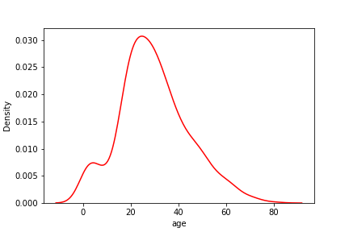
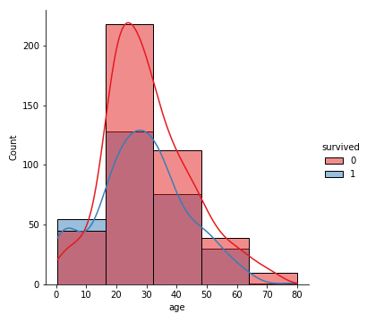

# Seabron-Plots-Visualization

Data visualization provides insight into the distribution and relationships between variables in a dataset. This insight can be helpful in selecting data preparation techniques to apply prior to modeling and the types of algorithms that may be most suited to the data. Seaborn is an open source python libraray build on top of matplotlib. It is used for data visualization and exploratory data analysis. The various plots avalilable in seaborn library along with eighteen inbuild datasets are:

# Count PLot

A count plot is helpful when dealing with categorical values. It is used to plot the frequency of the different categories. We acn pass following arguments to the countplot function:
1. Data-The dataframe
2. x-The name of the column
3. Hue-The name of the categorical column to split the bars
4. Palette-The color of the palette to be used

# KDE(Kernel Density Plot)

A Kernel Density Estimate(KDE) plot is used to plot the distribution of continuous data. The parameters of kdeplot() function are:
1. Data-The dataframe.
2. x-The name of the column to be plot.
3. color-The color of  the graph.

# Distribution Plot

A distribution plot is similat to a KDE plot. It is used to plot the distribution of continuous data along with the histogram bars. The parameters of the displot() function are:
1. kde-It is set to false by default. However, if you wish to plot a KDE graph on top of the bars, you can set it to true.
2. Bins-The number of bins/bars. The lower the number, wider the bars and wider the intervals.

Hue and palette can also be passed to custommize the graphs.

# Lm Plot

# Scatter Plot

Scatter plot is used to plot individual element. A scatter plot requires data for its x-axis and y-axis. A value for hue parameter can also be passed to color the dots based on the categorical columns.

# Joint Plot
A joint plot is also used to plot the correlation between data. The kind of plot to be plotted can be of the following:

scatter, hist, hex, kde, reg, resid

# Heat Maps

A haet maps can be used to visualize confusion, amtrices, and correlation. The color scheme, the minimum/mximum values, and annotations can also be customized.

# Violin Plot

It is similar to the boxplot except that it provides a higher, more advanced visualization and uses the kernel density estimation to give a better description about the data distribution.

Setting split=True will draw half of a violin for each level. This can make it easier to directly compare the distributions.

